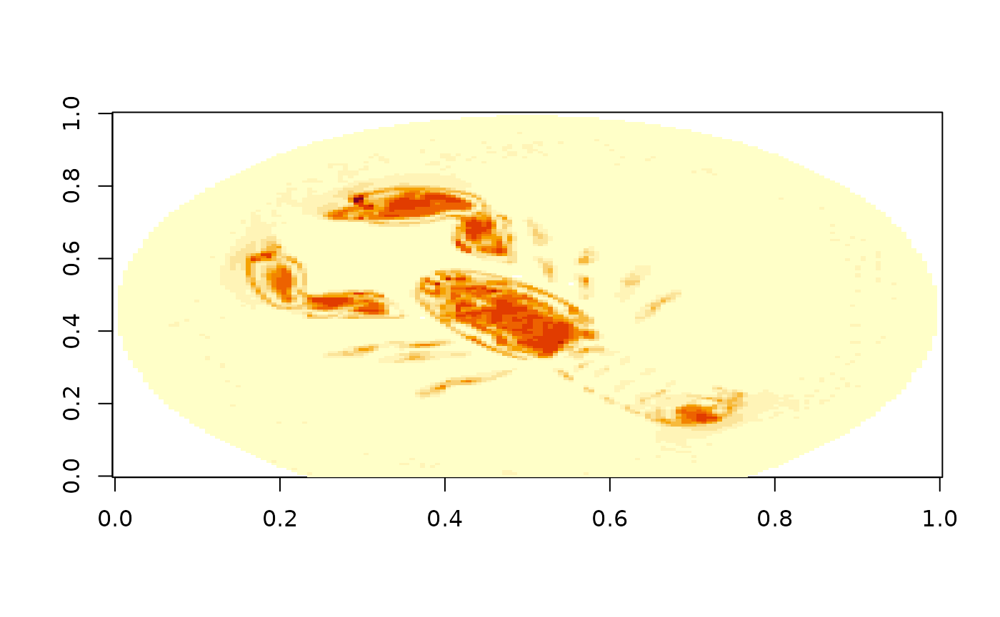

# 5. S3 stores

The `zarr` package can read and write online stores in S3 buckets,
meaning that Zarr stores published through Amazon Web Services (AWS) are
accessible. Access is read-only by default; properly authenticated users
may also write to the store. This package supports a variety of URLs to
access S3 stores, but manual protocol setting may be necessary to
distinguish between HTTP and S3 stores.

## Accessing S3 buckets

S3 buckets tend to be *very* large and there is a significant variety in
layouts. As a result, you should have some prior knowledge on how to
locate and retrieve the data, usually from a web site by the data
producer. This package has a utility function to crawl over the folder
hierarchy of an S3 bucket for which you have the name and optionally the
`region` and the URL (`endpoint` in S3 terminology) if not a standard S3
server on AWS:

``` r

# Crawling ome-zarr-scivis, a public-access repository of Zarr OME data
s3_list_dir("ome-zarr-scivis", region = "us-east-1")
#> [1] "v0.4/" "v0.5/"

# Two versions of OME: drill further down
s3_list_dir("ome-zarr-scivis", region = "us-east-1", prefix = "v0.5")
#>  [1] "v0.5/128x0/"     "v0.5/128x2-ozx/" "v0.5/128x2/"     "v0.5/128x4/"    
#>  [5] "v0.5/64x0/"      "v0.5/64x2-ozx/"  "v0.5/64x2/"      "v0.5/64x4/"     
#>  [9] "v0.5/96x0/"      "v0.5/96x2-ozx/"  "v0.5/96x2/"      "v0.5/96x4/"

# Image layouts: drill further down
(ome <- s3_list_dir("ome-zarr-scivis", region = "us-east-1", prefix = "v0.5/128x4"))
#>  [1] "v0.5/128x4/3d_neurons_15_sept_2016.ome.zarr/"          
#>  [2] "v0.5/128x4/aneurism.ome.zarr/"                         
#>  [3] "v0.5/128x4/backpack.ome.zarr/"                         
#>  [4] "v0.5/128x4/beechnut.ome.zarr/"                         
#>  [5] "v0.5/128x4/blunt_fin.ome.zarr/"                        
#>  [6] "v0.5/128x4/bonsai.ome.zarr/"                           
#>  [7] "v0.5/128x4/boston_teapot.ome.zarr/"                    
#>  [8] "v0.5/128x4/bunny.ome.zarr/"                            
#>  [9] "v0.5/128x4/carp.ome.zarr/"                             
#> [10] "v0.5/128x4/chameleon.ome.zarr/"                        
#> [11] "v0.5/128x4/christmas_tree.ome.zarr/"                   
#> [12] "v0.5/128x4/csafe_heptane.ome.zarr/"                    
#> [13] "v0.5/128x4/duct.ome.zarr/"                             
#> [14] "v0.5/128x4/engine.ome.zarr/"                           
#> [15] "v0.5/128x4/foot.ome.zarr/"                             
#> [16] "v0.5/128x4/frog.ome.zarr/"                             
#> [17] "v0.5/128x4/fuel.ome.zarr/"                             
#> [18] "v0.5/128x4/hcci_oh.ome.zarr/"                          
#> [19] "v0.5/128x4/hydrogen_atom.ome.zarr/"                    
#> [20] "v0.5/128x4/jicf_q.ome.zarr/"                           
#> [21] "v0.5/128x4/kingsnake.ome.zarr/"                        
#> [22] "v0.5/128x4/lobster.ome.zarr/"                          
#> [23] "v0.5/128x4/magnetic_reconnection.ome.zarr/"            
#> [24] "v0.5/128x4/marmoset_neurons.ome.zarr/"                 
#> [25] "v0.5/128x4/marschner_lobb.ome.zarr/"                   
#> [26] "v0.5/128x4/miranda.ome.zarr/"                          
#> [27] "v0.5/128x4/mri_ventricles.ome.zarr/"                   
#> [28] "v0.5/128x4/mri_woman.ome.zarr/"                        
#> [29] "v0.5/128x4/mrt_angio.ome.zarr/"                        
#> [30] "v0.5/128x4/neghip.ome.zarr/"                           
#> [31] "v0.5/128x4/neocortical_layer_1_axons.ome.zarr/"        
#> [32] "v0.5/128x4/nucleon.ome.zarr/"                          
#> [33] "v0.5/128x4/pancreas.ome.zarr/"                         
#> [34] "v0.5/128x4/pawpawsaurus.ome.zarr/"                     
#> [35] "v0.5/128x4/pig_heart.ome.zarr/"                        
#> [36] "v0.5/128x4/present.ome.zarr/"                          
#> [37] "v0.5/128x4/prone.ome.zarr/"                            
#> [38] "v0.5/128x4/richtmyer_meshkov.ome.zarr/"                
#> [39] "v0.5/128x4/shockwave.ome.zarr/"                        
#> [40] "v0.5/128x4/silicium.ome.zarr/"                         
#> [41] "v0.5/128x4/skull.ome.zarr/"                            
#> [42] "v0.5/128x4/spathorhynchus.ome.zarr/"                   
#> [43] "v0.5/128x4/stag_beetle.ome.zarr/"                      
#> [44] "v0.5/128x4/statue_leg.ome.zarr/"                       
#> [45] "v0.5/128x4/stent.ome.zarr/"                            
#> [46] "v0.5/128x4/synthetic_truss_with_five_defects.ome.zarr/"
#> [47] "v0.5/128x4/tacc_turbulence.ome.zarr/"                  
#> [48] "v0.5/128x4/tooth.ome.zarr/"                            
#> [49] "v0.5/128x4/vertebra.ome.zarr/"                         
#> [50] "v0.5/128x4/vis_male.ome.zarr/"                         
#> [51] "v0.5/128x4/woodbranch.ome.zarr/"                       
#> [52] "v0.5/128x4/zeiss.ome.zarr/"
```

The list above gives the Zarr stores (“.zarr” extension, as per the Zarr
specification recommendation). These can be accessed in the usual
fashion but take care to strip the trailing slash: the listing gives
Zarr prefixes, which end in a trailing slash, but for opening a Zarr
store you should specify the root of the store, not its prefix.

``` r

# Pick one, strip the trailing slash
z <- open_zarr(paste("s3://ome-zarr-scivis", trimws(ome[22], "right", "/"), sep = "/"))
#> Loading required namespace: qs2
z$hierarchy()
#> <Zarr hierarchy> s3://ome-zarr-scivis/v0.5/128x4/lobster.ome.zarr/ 
#> ☰ / (root group)
#> ├ ☰ scale0
#> │ └ ⌗ lobster
#> └ ☰ scale1
#>   └ ⌗ lobster

# Let's study the lobster ("scale1" is reduced resolution)
z[['/scale1/lobster']]
#> <Zarr array> ⌗ lobster 
#> Path      : /scale1/lobster 
#> Data type : uint8 
#> Shape     : 56 162 150 [z, y, x]
#> Chunking  : 28 81 150
image(z[['/scale1/lobster']][22,,])
```



## Authentication

This package does not manage authentication for S3 buckets. S3 access is
provided by the `paws.storage` package. Refer to the documentation on
[credentials](https://www.paws-r-sdk.com/developer_guide/credentials/)
of that package. Most (if not all) of the options for passing
credentials to S3 provided by `paws` are supported by this package.

## Working with array data from a S3 bucket

You can work with array data just like you would be array data from a
file system store: index it like any other R array. Keep in mind,
though, that the data will be fetched over your internet connection so
be very judicious in your indexing. Downloading a full array is almost
always a bad idea as Zarr arrays tend to be large.

A more intelligent way to download data is to look at the chunking of
the array data. From the “Chunking” details we can see that a chunk (the
unit of downloading data) is all of the “x” extent and half of “y” and
“z” each. The most efficient way of downloading the data is then to
follow the chunking scheme and download blocks of data aligned with the
chunk boundaries.
